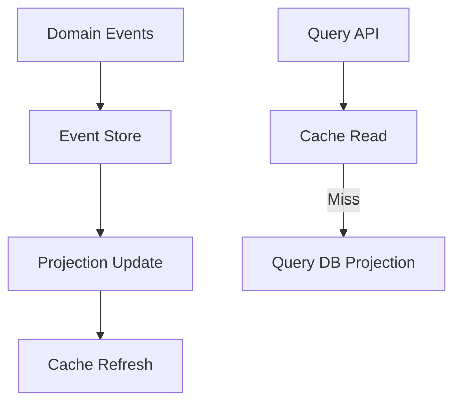

# Caching

---

## Caching Strategies

### 🔄 Cache-Aside (Lazy Loading)

**How it works:**  
The app reads from the cache first. On a miss, it fetches from the DB and stores the result in the cache for next time.

**Pros:**

- Easy to implement
- Fine-grained control
- Reduces DB load on repeated reads

**Cons:**

- Manual cache population
- Risk of stale data
- Miss penalty on first access

**Use Cases:** Product details, session data, read-heavy traffic

**Code Snippet:**

```python
def get_data(key):
    val = cache.get(key)
    if val is None:
        val = db.query(key)
        cache.set(key, val)
    return val
```

---

### ✍️ Write-Through

**How it works:**  
Every write updates both the cache and the database simultaneously.

**Pros:**

- Strong consistency
- Simplifies reads
- Always up-to-date cache

**Cons:**

- Higher write latency
- Increased system complexity

**Use Cases:** User profiles, config data, frequently read and updated data

**Code Snippet:**

```python
def write_data(key, val):
    cache.set(key, val)
    db.write(key, val)
```

---

### 🕰️ Write-Behind (Write-Back)

**How it works:**  
Write hits the cache first; data is flushed to the DB asynchronously.

**Pros:**

- High write throughput
- Lower latency on writes

**Cons:**

- Risk of data loss on failure
- Complex error handling and ordering

**Use Cases:** Logging pipelines, queued telemetry, real-time analytics

**Code Snippet:**

```python
def write_data(key, val):
    cache.set(key, val)
    # background job or buffer to flush to DB
```

---

### 📥 Read-Through

**How it works:**  
App always queries the cache; the cache itself knows how to retrieve and store missing data from the DB.

**Pros:**

- Cleaner application code
- Centralized logic

**Cons:**

- Cache becomes a point of dependency
- Harder to swap cache implementations

**Use Cases:** API caching, distributed microservices

**Concept:**  
Implemented via cache middleware or vendor-backed abstraction.  
E.g., Redis get triggers loading function on miss.

---

### 🔁 Refresh-Ahead

**How it works:**  
Cache pre-fetches data before it expires to keep entries warm.

**Pros:**

- Minimal latency
- Avoids cold-starts

**Cons:**

- Higher network utilization
- Risk of refreshing unused keys

**Use Cases:** Frequently accessed dashboards, trending feeds, monitoring tools

**Concept:**  
Set TTL + schedule refresh  
`scheduler.every(ttl - buffer).do(refresh_key)`

---

### ⏱️ Passive Expiry (TTL-Based)

**How it works:**  
Each entry is valid for a fixed duration before being evicted automatically.

**Pros:**

- Simple to configure
- Eliminates stale data

**Cons:**

- Can lead to stampedes after mass expiry
- No control over priority

**Use Cases:** CDN content, temporary reports, external API responses

**Code Snippet:**

```python
cache.set(key, val, ttl=300)  # 5-minute expiry
```

---

### 🧼 Explicit Invalidation

**How it works:**  
Application manually updates or removes cache entries when the underlying data changes.

**Pros:**

- Precise control
- Always reflects business logic

**Cons:**

- Developer overhead
- Potential for missed invalidation

**Use Cases:** Inventory updates, admin-driven dashboards

**Code Snippet:**

```python
cache.delete(key)  # or
cache.set(key, new_val)
```

---

## 🧹 Eviction Policies Deep Dive

### 🔁 LRU (Least Recently Used)

Evicts the item that hasn’t been accessed in the longest time.

**Pros:** Simple, intuitive; prioritizes active data  
**Cons:** Doesn’t consider frequency; may evict frequently used data if accessed long ago  
**Use Cases:** Web sessions, UI components

**Conceptual Code:**

```python
cache = LRUCache(capacity)
cache.get(key)  # promotes key to most-recent
cache.put(key, val)  # evicts oldest if over capacity
```

---

### 🔁 LFU (Least Frequently Used)

Evicts the item accessed least often.

**Pros:** Great for hot data; frequency-based priority  
**Cons:** New items may be starved; overhead of tracking counts  
**Use Cases:** Recommendation engines, API response caching

**Conceptual Code:**

```python
cache = LFUCache(capacity)
cache.get(key)  # increment access count
cache.put(key, val)  # evicts lowest count
```

---

### 🧠 MRU (Most Recently Used)

Evicts the item that was most recently accessed.

**Pros:** Useful in specific access patterns; prevents cache pollution  
**Cons:** Often counterproductive; rarely ideal outside niche cases  
**Use Cases:** Undo history, stack-based navigation

---

### 🌊 FIFO (First In First Out)

Evicts the oldest item, regardless of access.

**Pros:** Easy to implement; predictable  
**Cons:** Ignores actual usage; evicts potentially hot data  
**Use Cases:** Streaming systems, temporary queues

**Conceptual Code:**

```python
queue.push(key)  # add to end
if capacity exceeded:
    queue.pop_front()  # remove oldest
```

---

### 🧬 Random Replacement

Evicts a random item.

**Pros:** Fast; works well with uniform access  
**Cons:** Poor performance with non-uniform traffic  
**Use Cases:** Large-scale caches with probabilistic reuse, load balancing strategies

**Conceptual Logic:**  
`evict random.choice(cache.keys())`

---

### 🧠 Adaptive Replacement Cache (ARC)

Evicts based on both recency and frequency.

**Pros:** Balances LRU & LFU intelligently; self-tuning  
**Cons:** More complex implementation  
**Use Cases:** Database buffers, high-performance systems under variable load

---

### 🔍 Choosing the Right One

| Pattern                | Strategy         |
|------------------------|-----------------|
| User-driven access     | LRU or LFU      |
| High churn/freshness   | FIFO or TTL     |
| Equal access           | Random          |
| Fluctuating workload   | ARC             |

---

## 🕰️ TTL (Time To Live)

**Definition:**  
TTL defines the duration a cache entry remains valid before it's considered expired.

**Example:**  
`cache.set(key, value, ttl=60)  # valid for 60 seconds`

**Use Cases:** CDN content freshness, API rate-limiting state, temporary data or polling optimizations

**Pros:**  
✅ Simple and predictable  
✅ Prevents stale data accumulation

**Cons:**  
❌ Can cause cache stampedes after mass expiry  
❌ Doesn’t adapt to access patterns

---

## 📦 Cache Hit / Cache Miss

- **Hit:** Data is found in cache — fast return ✅
- **Miss:** Data not found — fallback to source and then populate cache ❌

**Metrics Tip:**  
Track hit rate:  
`Hit Rate = Cache Hits / Total Requests`

---

## ♻️ Eviction

**Definition:**  
The process of removing cache entries to free up memory based on a defined policy (e.g., LRU, LFU, FIFO).

**Why it matters:**  
Eviction must balance resource limits, performance, and usage patterns.

---

## 🚨 Cache Stampede

**Definition:**  
A surge of requests causes all to miss at once, hammering the backend system.

**Mitigation Strategies:**

- Use distributed locking
- Add jitter to TTL
- Use refresh-ahead strategy

---

## 🛂 Cache Coherence

**Definition:**  
Ensuring cached data remains consistent with its source of truth.

**Patterns:**

- Event-driven updates (e.g., Kafka or CDC)
- Versioning keys (e.g., user:123:v5)
- External invalidation triggers

---

## 🔐 Cache Warming

**Definition:**  
Preloading cache with known frequently accessed data at system startup or deployment.

**Benefits:**  

- Reduced cold starts
- Smoother load ramp-up

**Common in:** Feature flag services, dashboards

---

## 🔄 Rehydration / Lazy Fetching

**Definition:**  
Populating cache only on demand (often via Cache-Aside strategy).

**Trade-off:**  
Initial latency vs. memory efficiency.

---

## 🧮 Serialized Caching / Compression

**Definition:**  
Storing compact, serialized objects (e.g., Protocol Buffers, MsgPack, or compressed JSON) for space savings.

**When to use:**  

- High-volume key space
- Memory-constrained environments

---

## 🗺️ What Is Distributed Caching?

**Definition:**  
A caching model where data is stored across multiple machines in a coordinated way, ensuring availability and speed while avoiding single points of failure.

**Why It Matters:**  
In monoliths, a local cache might suffice. But in microservices, you need shared, resilient caching to serve consistent views across services and nodes.

**Key Components:**

- Partitioning (Sharding)
- Replication
- Consistency Controls
- Eviction and TTL Management
- Client-Side Awareness

**Technologies:**

| Tool                | Strengths                  | Use Cases                    |
|---------------------|---------------------------|------------------------------|
| Redis Cluster       | In-memory speed + sharding| Real-time dashboards, session stores |
| Memcached           | Lightweight, simple, LRU  | Web page fragments, ephemeral caches |
| Hazelcast/Infinispan| Embedded JVM, cache grid  | Java-heavy microservices      |
| Apache Ignite       | SQL + distributed memory   | Compute grids, analytics      |
| ElastiCache/Azure   | Cloud-managed, auto-scaling| Multiregion apps             |

---

## 🧠 Patterns & Strategies

### 🔁 Data Partitioning

- Hash-based key sharding (e.g., hash(key) % N)
- Manual routing in client
- Benefits: Horizontal scalability
- Watch out: Rebalancing complexity

### ✍️ Write Policies

- Write-through: Immediate update across cache and DB
- Write-behind: Queue updates and batch persist
- Conflict Handling: Consider clock skew, versioning

### 🧮 Coherence Patterns

- Use event-driven updates (Kafka, CDC)
- Incorporate versioned keys (user:123:v4)
- Use pub-sub for cache invalidation

**Common Challenges:**

- Network Latency
- Stale Reads
- Cache Stampede
- Failover

**Advanced Ideas:**

- Geo-distributed Caching
- Hybrid Layering
- Observability

---

## 🌐 What Is Geo-distributed Caching?

**Definition:**  
A caching strategy that replicates or partitions data across multiple geographic regions to serve nearby users faster and more reliably.

**Design Approaches:**

- Edge Caching via CDN
- Regional Caching Clusters
- Global Key Sharding

**Strategies for Consistency & Failover:**

- Event-driven sync
- Stale-tolerant reads
- Client-side fallbacks

**Architectural Challenges:**

| Challenge           | Solution                        |
|---------------------|---------------------------------|
| 🌐 Network Latency  | Use edge nodes, preload data    |
| 🔄 Data Drift       | Sync via events, versioned keys |
| 🎯 Routing Complexity | DNS geolocation, smart SDKs   |
| 🧭 Regulatory Boundaries | Region-aware sharding, TTL  |

**Example Stack Setup:**

| Layer         | Tool                  |
|---------------|----------------------|
| CDN Edge      | Cloudflare/CloudFront|
| Regional Cache| Redis Cluster per zone|
| Sync          | Kafka/EventBridge    |
| Failover Logic| Smart SDK with retry |

---

## 🌐 Content Delivery Network (CDN) Cheat Sheet

**What Is a CDN?**  
A CDN is a geographically distributed network of proxy servers and edge nodes that deliver content to users based on proximity.

**Core Components:**

| Component         | Purpose                   |
|-------------------|--------------------------|
| Edge Nodes        | Cache content close to users|
| Origin Server     | Primary source of truth  |
| PoP (Point of Presence)| Location with CDN servers|
| Cache-Control Headers| Define TTL, freshness, invalidation|
| Request Routing   | DNS or IP-based geolocation|

**What Can Be Cached?**

- Static assets
- Dynamic content
- API responses
- ML models, software packages, config files

**TTL and Cache Control:**  
Use HTTP headers:  
`Cache-Control: public, max-age=3600`  
`Expires: Sat, 20 Jul 2025 16:00:00 GMT`  
`ETag: "v2.1.3"`

**Common CDN Pitfalls:**

| Issue             | Solution                  |
|-------------------|--------------------------|
| ❌ Stale content  | Use ETag or versioned URLs|
| ❌ Cache poisoning| Validate query params     |
| ❌ High origin traffic| Optimize TTL, origin shielding|
| ❌ Geo inconsistencies| Region-aware invalidation|

**Popular CDN Providers:**

| Provider          | Specialty                 |
|-------------------|--------------------------|
| Cloudflare        | Security + Edge Functions|
| Akamai            | Enterprise-grade scale    |
| AWS CloudFront    | Deep AWS integration      |
| Fastly            | Developer-friendly, edge compute|
| Azure Front Door  | Global routing + Azure   |

**Advanced Architectures:**

- Origin Shielding
- Edge Computing
- Multi-CDN Strategy

---

## 🧱 Hybrid Layering in Caching

**Definition:**  
A strategic combination of caching layers — CDN edge cache, application memory, and distributed cache — to minimize latency and optimize system resource use.

**Typical Layer Stack:**

| Layer             | Scope         | Technology Example      | Role                       |
|-------------------|--------------|------------------------|----------------------------|
| Browser Cache     | Client-side  | Browser storage        | Ultra-local, instant reads |
| CDN Edge Cache    | Global edge  | Cloudflare, Akamai     | Static assets near users   |
| Distributed Cache | Shared       | Redis Cluster, Memcached| Hot data across nodes      |
| App Memory Cache  | Local        | In-memory structures   | Fastest access, per-node   |
| Persistent Store  | Central DB   | SQL/NoSQL databases    | Source of truth            |

**Benefits:**

- Latency Optimization
- Load Distribution
- Access Tiering
- Resilience

**Cache Population Workflow:**


**Key Design Considerations:**

- Cache Key Design
- Invalidation Strategy
- Observability
- Consistency Models

**Advanced Enhancements:**

- Edge Functions
- Adaptive TTL
- Multi-layer Tracing
- Compression & Serialization

---

## ⚠️ Cache Stampede Prevention

**What It Is:**  
A “thundering herd” problem where many requests hit a cache key right after it expires, overwhelming the backend.

**Prevention Techniques:**

| Technique           | Description                        | Pros                | Cons                |
|---------------------|------------------------------------|---------------------|---------------------|
| Mutex Locking       | First requester populates cache    | Prevents duplicate  | Adds latency        |
| Double-Checked Cache| Check before/after lock            | Avoids unnecessary  | Logic complexity    |
| Jittered TTL        | Randomize TTL expiration           | Staggers expiry     | Less predictability |
| Request Coalescing  | Batch identical requests           | Reduces backend load| Requires batching   |

**Example: Mutex Guard**

```python
def get_data(key):
    val = cache.get(key)
    if val is None:
        if lock.acquire(key):
            val = db.query(key)
            cache.set(key, val, ttl=random_ttl())
            lock.release(key)
        else:
            wait()  # or retry
    return val
```

---

## 🔑 Cache Key Design

**What It Is:**  
The structure and naming of your cache keys to enable fast access, minimize conflicts, and support clear invalidation logic.

**Design Considerations:**

| Concept             | Purpose                | Example              |
|---------------------|-----------------------|----------------------|
| Namespace Prefixing | Isolate domains        | auth:user:123        |
| Versioning          | Track schema changes   | product:456:v2       |
| Composite Keys      | Multi-dimensional      | order:US:2025:9876   |
| Tenant Isolation    | Multi-tenancy boundary | tenantA:user:123     |
| Hashing Strategy    | Normalize key values   | hash(email@domain.com)|

**Best Practices:**

- Avoid raw PII
- Keep keys readable
- Short keys perform better
- Use consistent formatting

**Pitfalls to Avoid:**

| Pitfall             | Impact                  |
|---------------------|------------------------|
| Colliding keys      | Data leakage            |
| No versioning       | Invalidation fails      |
| Dynamic query params| Memory bloat            |
| Timestamp suffixes  | Reduced reusability     |

---

## ⚖️ Consistency Trade-offs in Caching

**What It Is:**  
Balancing how “fresh” cached data is against performance, scalability, and fault tolerance.

**Types of Consistency:**

| Model               | Description             | Impact                |
|---------------------|------------------------|-----------------------|
| Strong Consistency  | Always latest DB state  | Safer but slower      |
| Eventual Consistency| Updates over time       | Faster, may be stale  |
| Read-Your-Writes    | User sees own changes   | Personalized correctness|

**Strategies to Manage:**

| Strategy            | Implementation         | When to Use           |
|---------------------|-----------------------|-----------------------|
| TTL + Manual        | Control freshness     | Mixed workloads       |
| Versioned Keys      | Include version tag   | Schema changes        |
| Event-Driven Sync   | Invalidate from events| CQRS, microservices   |
| Background Refresh  | Periodic updates      | Trending/stable data  |

**Trade-offs:**

| Trade-off           | Description            |
|---------------------|-----------------------|
| Latency vs Freshness| Faster may be stale   |
| Accuracy vs Availability| More accurate = fragile|
| Performance vs Complexity| Write-through adds overhead|

**Example: Eventual Consistency**

```python
def get_profile(user_id):
    key = f"profile:{user_id}"
    profile = cache.get(key)
    if profile is None:
        profile = db.query(key)
        cache.set(key, profile, ttl=600)
    return profile
# Cache refreshed periodically or on update event
```

---

## 📊 Observability & Telemetry in Caching

**What It Is:**  
Instrumentation and logging that help track cache behavior, performance, and correctness.

**Key Metrics:**

| Metric              | Description             | Insight                |
|---------------------|------------------------|------------------------|
| Hit Rate            | Hits vs total requests  | Efficiency             |
| Eviction Count      | Entry removal frequency | Memory pressure        |
| Miss Latency        | Miss handling time      | Backend responsiveness |
| TTL Expirations     | Items expired by TTL    | Freshness/volatility   |
| Load Time per Key   | Load/insert duration    | Slow keys/bottlenecks  |

**Logging & Tracing Hooks:**

- Trace spans for cache access, TTL expiration, fallback duration
- Tag logs with cache tier
- Include key metadata

**Sample Logging:**

```json
{
  "key": "user:123:v4",
  "action": "cache_miss",
  "tier": "redis_cluster",
  "fallback_ms": 125,
  "ttl": 600,
  "source": "postgres"
}
```

**Tooling Suggestions:**

| Category   | Tools                        |
|------------|-----------------------------|
| Metrics    | Prometheus, Grafana, Datadog|
| Tracing    | OpenTelemetry, Jaeger, Zipkin|
| Logging    | FluentBit, ELK, Loki        |

---

## 🧼 Cache Invalidation Protocols

**What It Is:**  
Methods to update or remove cache entries when the source-of-truth changes.

**Invalidation Types:**

| Type                | Description             | Ideal When...          |
|---------------------|------------------------|------------------------|
| Manual Invalidation | App removes outdated   | Precise control        |
| Time-based Expiry   | Keys expire after time | Data freshness         |
| Event-driven        | External events purge  | Async source changes   |
| Versioned Keys      | Semantic version in key| Deployment/schema      |
| Write-through       | Writes update both     | High consistency       |
| Refresh-ahead       | Auto-update before exp | Preemptive warming     |

**Event-driven Invalidation Strategies:**

| Tool         | Pattern         | Use Case                  |
|--------------|-----------------|---------------------------|
| Kafka Topic  | Entity updates  | CQRS read model, profile  |
| CDC Stream   | DB changes      | Real-time reporting       |
| Pub/Sub      | Broadcast purge | Distributed microservices |

**Example: Event-Driven Purge**

```python
def on_event(event):
    if event.type == "user_updated":
        key = f"user:{event.id}:v4"
        cache.delete(key)
```

Bonus: For immutable data, skip invalidation and just update version (user:123:v5).

---

## 🧁 Multi-layer Caching Coordination

**What It Is:**  
Orchestrating multiple caching layers so they work together in TTL, invalidation, key strategy, and fallbacks.

**Common Layer Stack:**

| Layer             | Scope         | Speed     | Example             |
|-------------------|--------------|-----------|---------------------|
| App Memory (LRU)  | Per-instance | 🟢 Fastest| localCache.get()    |
| Distributed Cache | Cluster-wide | 🟡 Fast   | Redis, Memcached    |
| CDN / Edge Cache  | Geo-distrib. | 🔴 Medium | Cloudflare, Akamai  |
| Origin DB         | Source       | ⚫ Slow   | SQL, NoSQL          |

**Coordination Strategies:**

| Pattern            | Purpose                  |
|--------------------|-------------------------|
| TTL Alignment      | Avoid mismatch across tiers|
| Key Normalization  | Same key logic across layers|
| Fallback Cascading | Read-through path        |
| Layered Observability| Track hit/miss rates   |
| Selective Bypass   | Force refresh for critical|

**TTL Management Example:**

- App memory = 60s TTL
- Redis = 300s TTL
- CDN = 1h TTL

**Metrics You Should Log:**

- Hit rate per layer
- Eviction source
- Fallback durations
- Origin DB pressure

---

## 🧬 Serialization & Memory Efficiency in Caching

**What It Is:**  
Transforming data into compact formats before storing in cache.

**Common Formats:**

| Format     | Description         | Pros         | Cons           |
|------------|---------------------|--------------|----------------|
| JSON       | Human-readable      | Easy debug   | Verbose, slow  |
| Protobuf   | Binary, schema-based| Fast, small  | Needs schema   |
| MsgPack    | Binary, JSON-like   | Compact      | Less adoption  |
| Avro       | Schema-oriented     | Good w/ Kafka| Heavier        |

**Compression Options:**

| Method     | Benefit              | Trade-offs         |
|------------|----------------------|--------------------|
| Gzip       | Significant reduction| CPU overhead       |
| Snappy     | Fast, less compact   | Real-time systems  |
| Zstd       | High ratio + fast    | Integration needed |

**When to Use:**  

- High-cardinality keys
- Edge caching
- Memory-constrained tiers
- ML model serving

**Code Example: Protobuf in Redis**

```python
# Serialize
binary_data = protobuf_obj.SerializeToString()
redis.set(key, binary_data)

# Deserialize
raw = redis.get(key)
protobuf_obj.ParseFromString(raw)
```

---

## 🌍 Geographic Awareness in Caching

**What It Is:**  
Architect caching systems for user location, data sovereignty, and latency constraints.

**Architectural Strategies:**

| Strategy             | Description                | Use Case                |
|----------------------|---------------------------|-------------------------|
| Geo-partitioned Keys | Shard by region           | Regulatory segregation  |
| Regional Redis Clust.| Deploy per zone           | Multi-region platform   |
| CDN Edge Caching     | PoPs close to users       | Asset delivery          |
| Geo-aware Routing    | DNS/client SDK selects    | Real-time personalization|
| Compliant TTL + Purge| Region-specific expiry    | GDPR, retention rules   |

**Failover & Redundancy:**

- Local Fallback
- Stale Read Tolerance
- Event Replication

**Observability Across Regions:**

- Log hit/miss per region
- Track cross-zone fallback latency
- Audit cache reads/writes per zone

**Example: Geo-tagged Key Design**

```python
key = f"user:{region}:{user_id}:v2"  # e.g., user:EU:456:v2
```

---

## 🔄 Caching in CQRS + Event Sourcing

**What It Is:**  
Using caching to optimize read-side performance in CQRS and Event Sourcing architectures.

**Integration Patterns:**

| Pattern                | Role in System         | Benefits                |
|------------------------|-----------------------|-------------------------|
| Read-Model Cache       | Cache query projections| Ultra-fast reads        |
| Event Stream Snapshot  | Cache latest snapshot | Speeds up rehydration   |
| Cache-aside w/ Event   | Lazy load + event sync| Freshness & latency     |

**Projection Caching Flow:**



**Key Strategies:**

- Invalidate cache on domain event
- Store event snapshots
- TTL + versioned keys
- Use stream metadata for invalidation

**Example: Cache on Event Projection**

```python
def on_event(event):
    if event.type == "order_created":
        projection = build_projection(event.data)
        cache.set(f"order:{event.id}", projection, ttl=600)
```

**Observability Hooks:**

- Monitor lag between event and cache update
- Log stale reads
- Track cache hit rate per query type

---

## 🔍 Tool-Specific Internals (Redis, Memcached, CDN)

### 🧠 Redis Internals

| Feature           | Insight                  | Tips for Usage          |
|-------------------|-------------------------|-------------------------|
| Eviction Policy   | Configurable via policy  | LRU, LFU, volatile TTL  |
| Memory Structure  | SDS for strings, encoding| Monitor INFO MEMORY     |
| Persistence       | RDB snapshots + AOF logs | Performance vs durability|
| Cluster Mode      | Hash slots for sharding  | Monitor slot coverage   |
| Modules           | Extend w/ search, ML, etc| Domain-specific needs   |

Example:

```
maxmemory 2gb
maxmemory-policy allkeys-lru
```

---

### 🔧 Memcached Internals

| Feature           | Description              | Best Practices          |
|-------------------|-------------------------|-------------------------|
| Slab Allocation   | Fixed-size memory chunks | Avoid fragmentation     |
| LRU Segmentation  | Age bins for eviction    | Tune with lru_crawler   |
| Multithreaded Core| Concurrent processing    | Scale on CPU-heavy envs |
| No Persistence    | Pure in-memory           | Use for non-critical    |

Example:

```
memcached -m 2048 -c 1024 -t 4
```

---

### 🌐 CDN Behavior & Control

| Mechanism         | Description              | How to Use It           |
|-------------------|-------------------------|-------------------------|
| TTL & Cache-Control| Header-based expiration | Cache-Control: max-age=3600|
| ETag / Last-Modified| Conditional requests   | Reduces origin load     |
| Invalidation API  | Programmatic purge      | POST /invalidate?path=/article/123|
| Origin Shielding  | PoP caches from origin  | Burst protection        |
| Edge Functions    | Run logic at edge       | Personalization, auth   |

---

## Questions

### 📦 Core Concept Questions

1. **What is caching and why is it important in system design?**  
   *Answer:*  
   Caching is the practice of storing frequently accessed data in a fast-access storage layer (memory or disk) to reduce latency, improve throughput, and offload backend systems. It’s essential in scalable systems because it minimizes redundant computations and network/database calls.

2. **How does caching improve scalability and latency?**  
   *Answer:*  
   Caching reduces response time by avoiding round-trips to slow data sources. It improves scalability by decreasing load on upstream services or databases, allowing systems to handle more requests concurrently.

3. **What types of caching exist?**  
   *Answer:*  
   - Client-side cache: browser cache, local storage
   - CDN/Edge cache: geographically distributed static asset delivery
   - Application-level cache: in-memory, e.g., Redis or Memcached
   - Distributed cache: shared across multiple nodes or services
   - Database cache: cached query results or index layers

4. **What are cache hits and misses?**  
   *Answer:*  
   - Hit: Data is found in cache; served immediately
   - Miss: Data not found; must fetch from source and optionally cache the result  
   Formula: `Hit Rate = cache_hits / total_requests`

---

### 🔁 Caching Strategies

5. **Explain cache-aside vs read-through vs write-through.**  
   *Answer:*  
   - Cache-aside: App loads data into cache on miss. Manual control.
   - Read-through: Cache loads from DB automatically on miss. Transparent to app.
   - Write-through: Every write updates both DB and cache synchronously. Ensures consistency but adds latency.

6. **When would you prefer write-behind caching?**  
   *Answer:*  
   In systems requiring high write throughput and tolerance for eventual consistency (e.g., telemetry pipelines or batched log ingestion). The DB is asynchronously updated from cache.

7. **Describe refresh-ahead caching.**  
   *Answer:*  
   A cache proactively refreshes entries before they expire to avoid cold starts and maintain warm cache during traffic spikes. Ideal for predictable, trending data.

---

### 🧹 Eviction Policies & TTL

8. **What are common eviction policies?**  
   *Answer:*  
   - LRU (Least Recently Used)
   - LFU (Least Frequently Used)
   - FIFO (First In First Out)
   - Random Replacement  
   Each has trade-offs in memory efficiency and access pattern optimization.

9. **How do you choose an eviction policy?**  
   *Answer:*  
   Based on workload:
   - Use LFU for long-lived hot data (e.g., ML recommendations)
   - Use LRU for recency-based access (e.g., session data)
   - Use FIFO or Random for simplicity or stateless workloads

10. **How does TTL affect cache validity and performance?**  
    *Answer:*  
    TTL defines how long data remains valid. Short TTL ensures freshness but may increase backend traffic; long TTL reduces latency but risks serving stale data.

11. **How do you prevent cache stampedes?**  
    *Answer:*  
    Use:
    - Distributed locking
    - Double-checked cache
    - Jittered TTL values
    - Request coalescing to batch identical requests

### 🧠 Advanced Concepts

12. **How do you handle stale data in caching systems?**  
    *Answer:*  
    Strategies include:
    - TTL tuning + refresh-ahead
    - Event-driven invalidation
    - Stale-while-revalidate patterns
    - Versioned keys to reflect schema changes

13. **What consistency trade-offs exist in caching?**  
    *Answer:*  
    - Strong consistency: always in sync but slower
    - Eventual consistency: improves performance, tolerates staleness
    - Read-your-writes: ensures recent updates are visible to the user only

14. **How would you design cache invalidation in a multi-tenant system?**  
    *Answer:*  
    - Use tenant-prefixed keys (e.g., tenantA:user:123)
    - Include version tags for schema evolution
    - Isolate TTL and eviction policies per tenant
    - Use event-driven invalidation from tenant-scoped sources

15. **What are the challenges in caching dynamic or user-specific content?**  
    *Answer:*  
    - Personalization causes key explosion
    - Security risks with shared caches
    - TTL and invalidation must be tailored per user
    - Consider local app memory cache or hashed key obfuscation

### 🗺️ Distributed & Geo-Caching

16. **What is distributed caching and how does it scale?**  
    *Answer:*  
    Distributed caching spreads data across multiple cache nodes via sharding (e.g., Redis Cluster). It scales horizontally and supports high availability via replication, partitioning, and client-aware routing.

17. **How do you ensure cache coherence across nodes?**  
    *Answer:*  
    - Use event-driven sync (Kafka, CDC)
    - TTL alignment and versioned keys
    - Pub/Sub invalidation broadcasts
    - Conflict resolution via timestamps or last-write-wins

18. **How do you design geo-caching for global apps?**  
    *Answer:*  
    - Use CDN edge caching
    - Deploy regional Redis clusters
    - Geo-shard keys by region
    - Add fallback logic and observability across zones

19. **What’s the benefit of hybrid cache layering?**  
    *Answer:*  
    Combines speed and resilience:
    - App memory cache: lowest latency
    - Distributed cache: shared scalability
    - CDN cache: global reach
    - Prevents origin overload and enables graceful fallback

### 🧰 Tool-Specific & Performance Tuning

20. **How does Redis manage memory and eviction?**  
    *Answer:*  
    - Configurable via maxmemory-policy (e.g., allkeys-lru)
    - Supports RDB/AOF persistence
    - Slotted sharding in cluster mode
    - Use INFO MEMORY and MONITOR for diagnostics

21. **Compare Redis and Memcached.**  
    *Answer:*

    | Feature       | Redis                          | Memcached                  |
    |---------------|-------------------------------|----------------------------|
    | Data types    | Strings, hashes, lists, sets   | Strings only               |
    | Persistence   | RDB/AOF                        | None                       |
    | Clustering    | Redis Cluster                  | Not built-in               |
    | Use cases     | Complex caching, pub/sub       | Lightweight read cache     |

22. **How do CDN cache headers work?**  
    *Answer:*  
    - Cache-Control: max-age sets TTL
    - ETag and Last-Modified provide conditional validation
    - Vary headers differentiate caches by query/header

23. **Would you serialize or compress cache data?**  
    *Answer:*  
    Yes, when:
    - Memory is constrained
    - Payloads are large (e.g., ML models, analytics)
    Use formats like Protobuf, MsgPack, and compression via Snappy or Zstd

---

### 🧪 Observability & Edge Cases

24. **What cache metrics do you track?**  
    *Answer:*  
    - Hit/miss rates
    - Evictions
    - TTL expirations
    - Latency per layer
    - Fallback DB pressure

25. **How do you test caching in dev and CI?**  
    *Answer:*  
    - Use mocks for cache backend
    - Simulate TTL expiry
    - Add telemetry for cache hit assertions
    - Benchmark memory and latency under load

26. **How do you handle poisoned cache entries?**  
    *Answer:*  
    - Validate cache writes
    - Include checksums or schema tags
    - Monitor stale reads and purge based on anomaly triggers
    - Use retries + safe fallback